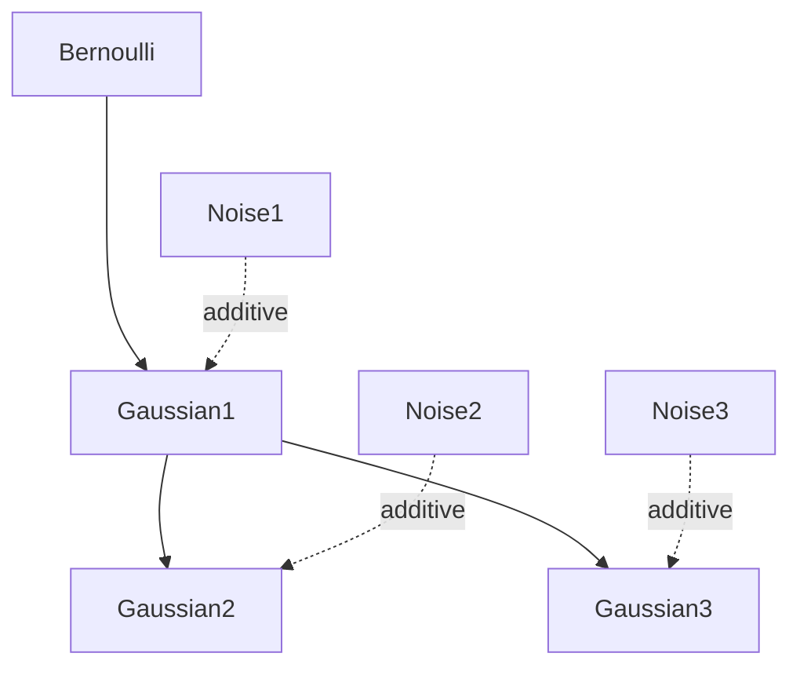
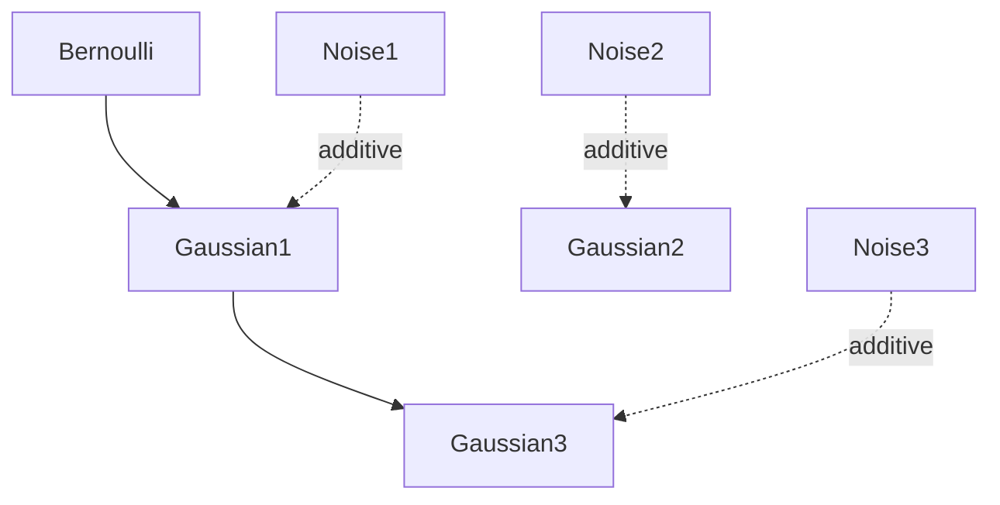
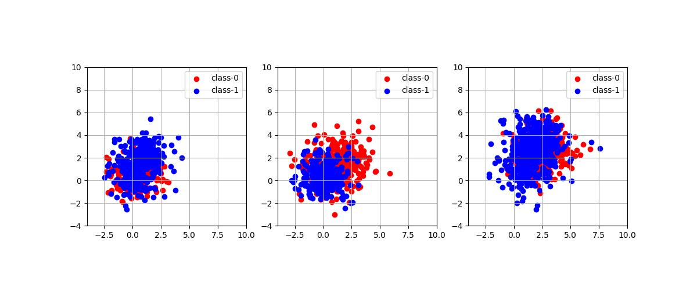
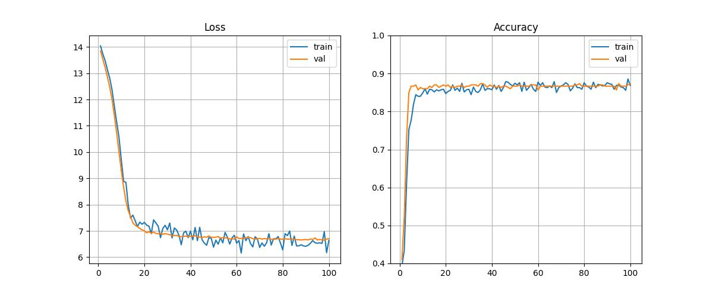

# Graph Convolution Testing
This repository serves as an example of how to use a Graph Convolution Network with graph-structured data. It utilizes functions from the PyTorch Geometric library, which can be found at https://pytorch-geometric.readthedocs.io/en/latest/index.html. For more detailed information, please refer to the documentation. It's important to note that PyTorch Geometric comprises multiple libraries, including torch_sparse, torch_cluster, and torch_scatter. Setting up the experimental environment can often be challenging and prone to failure. Therefore, it is strongly advised to follow the official documentation for setup rather than relying on the environment specified in this repository.

## Dataset
This program generates a dataset and classifies the data using a Graph Convolutional Network. The dataset has two possible structures, shown by the graphs below (Graph-1/Graph-2). Each structure consists of three two-dimensional Gaussian distributions, which produce six values. These are called Gaussian distributions 1, 2, and 3, and the structure of the graph is presented below. I will explain how they are generated for each structure. The mean of Gaussian distribution-1 is determined by a Bernoulli distribution, and then Gaussian distributions 2 and 3 are generated based on Gaussian distribution-1 in the Graph-1 generation process. However, in the Graph-2 generation process, Gaussian distribution-2 is independent of Gaussian distribution-1. The Bernoulli distribution is a hidden variable, and the observer can only see the values from the Gaussian distributions. Another factor is the additive Gaussian noise that is applied to all Gaussian distributions (1-3). The observer cannot know the exact amount of noise, but can know if the noise level is small or large. This condition can be considered when using a sensor. The observer can also see how the nodes are connected with edges. Under these conditions, this dataset can be viewed as a graph structure that has 3 nodes with 1 feature. Note that all Gaussian distributions are 2-dimensional. The data generated by each structure are assigned to class-0 or class-1. Both classes contain data from Graph-1 and Graph-2.

This repository solves the Graph-Classification-Task using this dataset.

### Graph-1



### Graph-2



## Data Modeling

When the noise volume is estimated being small, the feature value is 1. When it is estimated being big, the feature value is 2.
This feature is fed into pytorch-geometric as “x”. The two-dimensional values from the Gaussian distribution are fed into pytorch-geometric as “pos”. They represent the position in the 2D coordinate. The “edge_index” is decided based on the above data generation process. The figure below shows the position of the Gaussian distribution on each node. The red color indicates that the points belong to the class-0 dataset, and the blue color indicates that the points belong to the class-1 dataset. As you can see, these two distributions of datasets are almost overlapping, and look like unclassified information. But since these Gaussian distributions are strongly related to other Gaussian distributions and their relative positions, they are actually well classified.




The figure below shows the loss curves and the classification accuracy curves for the training and validation datasets. It shows that the graph structure classification model is well trained.



## How to test

### Installation
```bash
pip install torch
pip install -r requirements.txt
```

### Training
```bash
python -m src --gpu 2 --lr 1e-4
```

